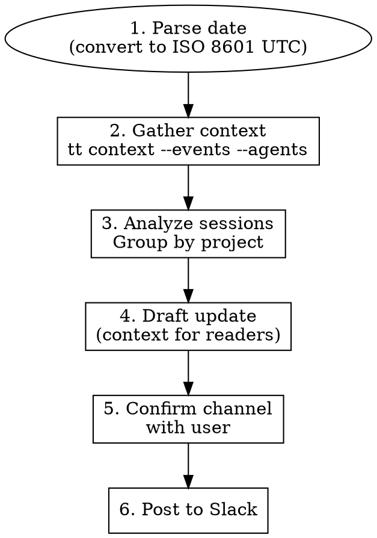

# Daily Standup

Generate and post a daily standup to Slack using time-tracker activity data.

## Arguments

- `channel`: Required. Slack channel name (e.g., `#ra-lab-notes-sami`)
- `date`: Optional. Day to report on (default: yesterday). Use natural language like "yesterday", "Feb 2", or ISO 8601.

Example: `/daily-standup #ra-lab-notes-sami yesterday`

## Workflow



## Phase 1: Parse Date

Convert user's date to ISO 8601 UTC range.

**Critical**: `tt context` only accepts ISO 8601 format or relative strings.

| User input | Start (UTC) | End (UTC) |
|------------|-------------|-----------|
| "yesterday" | Yesterday 08:00 UTC | Today 08:00 UTC |
| "Feb 2" | 2026-02-02T08:00:00Z | 2026-02-03T08:00:00Z |
| "today" | Today 08:00 UTC | Now |

Use `date` command to compute if needed:
```bash
# Yesterday's range (Pacific = UTC-8)
START=$(date -u -d "yesterday 00:00 PST" +%Y-%m-%dT%H:%M:%SZ)
END=$(date -u -d "today 00:00 PST" +%Y-%m-%dT%H:%M:%SZ)
```

## Phase 2: Gather Context

```bash
tt context --events --agents --start "$START" --end "$END"
```

This outputs JSON with:
- `agents[]`: Claude sessions with `project_name`, `summary`, `tool_call_count`, `start_time`, `end_time`
- `events[]`: Raw activity signals (used for direct time calculation)

## Phase 3: Analyze Sessions

Group agents by `project_name`. For each project:

1. **Count sessions** with substantive work (`tool_call_count > 10` or non-trivial summary)
2. **Extract work items** from `summary` field — if null, check `starting_prompt` for context
3. **Calculate delegated time**: Sum of `(end_time - start_time)` for sessions with both times; estimate for null end_times based on tool_call_count (~1 min per 10 tool calls)
4. **Note direct time**: Rough proxy using session count × 15-30 min per substantive session

**Filtering heuristics:**
- Skip sessions with `tool_call_count < 10` AND no meaningful summary
- Skip `/clear`, `/ide`, `/context` sessions (administrative, no real work)
- Include sessions where `starting_prompt` shows real user intent even if summary is null

**Project naming caveat:** The time-tracker extracts `project_name` from the working directory. For nested repos (e.g., `/eval-pipeline/pivot`), only the deepest directory is captured (`pivot`). Check `cwd` in events if work seems missing from a parent project.

## Phase 4: Draft Update

**Format: YTH (Yesterday, Today, Hopes/Blockers)**

Write for readers who have no context about your projects:

```markdown
## Standup - {Day of Week} {Date}

### Yesterday ({Date})

- **{Project}** — {time estimate}
  - {What was accomplished in 1 sentence, understandable to outsiders}
  - {Another accomplishment if significant}

- **{Project}** — {time estimate}
  - {Accomplishment}

**Totals:** ~{X} hrs direct | ~{Y} hrs delegated

{Optional: Brief note about slowdowns or context}

### Today

- {Plan item 1}
- {Plan item 2}

### Blockers

- {Blocker, or "None" if clear}
```

**Writing guidelines:**
- Project names should be recognizable (use repo names or common abbreviations)
- Accomplishments should be specific enough that someone unfamiliar can understand impact
- Avoid jargon like "refactoring" without saying what/why
- Time estimates are approximate—don't overthink precision
- Delegated time can be very high with parallel agents (10+ hours is normal for heavy days)

## Phase 5: Ask for "Today" Plans

The time-tracker data only shows past activity. Ask the user:
- "What are your plans for today?"
- "Any blockers?"

If user provided plans in the invocation, use those. Otherwise, infer reasonable continuations from yesterday's work (e.g., "continue X" or "open PR for Y").

## Phase 6: Confirm Before Posting

Show the drafted message and confirm:
- Target channel is correct
- Content looks accurate

Use AskUserQuestion if channel wasn't provided or to confirm before posting.

## Phase 7: Post to Slack

Use `mcp__slack__conversations_add_message`:
- `channel_id`: Use `#channel-name` format
- `content_type`: `text/markdown`
- `payload`: The drafted message

**Slack markdown note:** Slack's markdown support is limited. Nested bullets may appear flattened in some clients. Format for readability anyway—the structure helps even if rendering is imperfect.

```markdown
- **Project** — time
  - Sub-item (2 spaces before -)
  - Another sub-item
```

If posting fails:
1. Check channel name/ID
2. Try without special formatting
3. Report error to user

## Common Mistakes

| Mistake | Fix |
|---------|-----|
| Date format error | Use ISO 8601: `2026-02-02T08:00:00Z` or relative like "1 day ago" |
| Wrong year | Check current date first—don't assume from context |
| Updates too terse | Include context for outsiders ("what" and "why") |
| Missing sessions | Check `starting_prompt` when `summary` is null |
| Null end_time | Estimate from tool_call_count (~1 min per 10 calls) |
| No "Today" plans | Ask user—can't infer future plans from past data |

## Example Output

```markdown
## Standup - Mon Feb 3, 2026

### Yesterday (Feb 2)

- **Legion** — 2h direct | 10h delegated
  - Completed daemon worker monitoring implementation (workers now report health status)
  - Set up tmux-based session architecture for parallel agent execution

- **eval-pipeline** — 15min direct | 30min delegated
  - Started validation work for new test harness (in progress)

- **time-tracker** — 1h direct | 5h delegated
  - Fixed report time calculation to use period events, not cumulative totals

**Totals:** ~3h direct | ~15h delegated (parallel agent sessions)

### Today

- Finish eval-pipeline validation and open PR
- Debug Legion worker communication issues

### Blockers

- None currently
```
