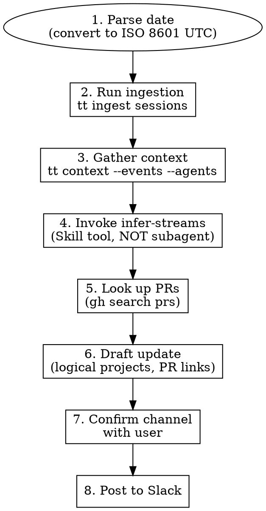

# Daily Standup

Generate and post a daily standup to Slack using time-tracker activity data.

## Arguments

- `channel`: Required. Slack channel name (e.g., `#ra-lab-notes-sami`)
- `date`: Optional. Day to report on (default: yesterday). Use natural language like "yesterday", "Feb 2", or ISO 8601.

Example: `/daily-standup #ra-lab-notes-sami yesterday`

## Workflow



## Phase 1: Parse Date

Convert user's date to ISO 8601 UTC range.

**Critical**: `tt context` only accepts ISO 8601 format or relative strings.

| User input | Start (UTC) | End (UTC) |
|------------|-------------|-----------|
| "yesterday" | Yesterday 08:00 UTC | Today 08:00 UTC |
| "Feb 2" | 2026-02-02T08:00:00Z | 2026-02-03T08:00:00Z |
| "today" | Today 08:00 UTC | Now |

Use `date` command to compute if needed:
```bash
# Yesterday's range (Pacific = UTC-8)
START=$(date -u -d "yesterday 00:00 PST" +%Y-%m-%dT%H:%M:%SZ)
END=$(date -u -d "today 00:00 PST" +%Y-%m-%dT%H:%M:%SZ)
```

## Phase 2: Run Ingestion

**CRITICAL: Always run ingestion before gathering context.** Session data is only available after ingestion — without this step you will miss most of the data.

```bash
cargo build 2>/dev/null && cargo run -- ingest sessions
```

This scans Claude Code and OpenCode session files and stores metadata in the database. Without it, `tt context` returns stale/incomplete data.

## Phase 3: Gather Context

```bash
tt context --events --agents --start "$START" --end "$END"
```

This outputs JSON with:
- `agents[]`: Claude sessions with `project_name`, `summary`, `tool_call_count`, `start_time`, `end_time`
- `events[]`: Raw activity signals (used for direct time calculation)

## Phase 4: Analyze Streams

**REQUIRED: Invoke the `infer-streams` skill** to analyze the `tt context` output. Do NOT try to analyze streams yourself or launch a subagent — use the Skill tool:

```
Skill("infer-streams")
```

The infer-streams skill handles:
- Grouping sessions into projects and streams
- Calculating direct vs delegated time
- Handling subdirectory merging, null end_times, etc.

Use its output (the time breakdown table and stream details) as the data source for drafting the standup.

## Phase 5: Look Up PRs

**CRITICAL: Always look up open and recently merged PRs to link in the report.** A standup without PR links is incomplete — readers want to see the artifacts.

```bash
# Open PRs
gh search prs --author=@me --state=open --limit=20 --json url,title,repository,state

# Recently merged PRs
gh search prs --author=@me --merged --sort=updated --limit=20
```

Match PRs to streams by repo name and title. Every accomplishment that produced or advanced a PR should link to it using markdown: `[PR #123](url)`.

## Phase 6: Draft Update

**Format: YTH (Yesterday, Today, Hopes/Blockers)**

Write for readers who have no context about your projects.

### Organize by Logical Project, Not Repository

**CRITICAL: Do NOT report streams grouped by repo directory.** The infer-streams output groups by repo path (e.g., `dotfiles`, `sami-home`, `eval-pipeline`). You MUST reorganize into logical projects that make sense to the reader.

**Common reorganizations:**
- Dotfiles/config repos are never a project — classify by what the work was actually for (e.g., install script for tool X → tool X project; PR reviews for repo Y → repo Y)
- Home directory sessions are usually meta-work — attribute to the actual project or group as "tooling"
- Multiple repos serving one goal should be combined (e.g., a library repo + the app that depends on it → one section)
- Infra debugging (CPU, disk, network) should be attributed to the project it was blocking

**Ask the user** if you're unsure how to group — they know what the logical projects are. Present your best guess and let them correct it.

### Include PR Links

Every accomplishment that produced or advanced a PR should include a markdown link: `[PR #123](url)`. Use the PRs gathered in Phase 5.

### Template

```markdown
## Standup - {Day of Week} {Date}

### Yesterday ({Date})

- **{Logical Project}** — {time estimate}
  - {Accomplishment} — [PR #N](url) (merged/open)
  - {Another accomplishment}

- **{Logical Project}** — {time estimate}
  - {Accomplishment} — [PR #N](url)

**Totals:** ~{X} hrs direct | ~{Y} hrs delegated

{Optional: Brief note about slowdowns or context}

### Today

- {Plan item 1}
- {Plan item 2}

### Blockers

- {Blocker, or "None" if clear}
```

**Writing guidelines:**
- Project names should be recognizable (use repo names or common abbreviations)
- Accomplishments should be specific enough that someone unfamiliar can understand impact
- Avoid jargon like "refactoring" without saying what/why
- Time estimates are approximate—don't overthink precision
- Delegated time can be very high with parallel agents (10+ hours is normal for heavy days)

## Phase 7: Ask for "Today" Plans

The time-tracker data only shows past activity. Ask the user:
- "What are your plans for today?"
- "Any blockers?"

If user provided plans in the invocation, use those. Otherwise, infer reasonable continuations from yesterday's work (e.g., "continue X" or "open PR for Y").

## Phase 8: Confirm Before Posting

Show the drafted message and confirm:
- Target channel is correct
- Content looks accurate

Use AskUserQuestion if channel wasn't provided or to confirm before posting.

## Phase 9: Post to Slack

Use `mcp__slack__conversations_add_message`:
- `channel_id`: Use `#channel-name` format
- `content_type`: `text/markdown`
- `payload`: The drafted message

**Slack markdown note:** Slack's markdown support is limited. Nested bullets may appear flattened in some clients. Format for readability anyway—the structure helps even if rendering is imperfect.

```markdown
- **Project** — time
  - Sub-item (2 spaces before -)
  - Another sub-item
```

If posting fails:
1. Check channel name/ID
2. Try without special formatting
3. Report error to user

## Common Mistakes

| Mistake | Fix |
|---------|-----|
| Skipping ingestion | **Always** run `tt ingest sessions` before `tt context`. Without it you miss most data. |
| Reporting by repo directory | Organize by logical project, not filesystem path. `dotfiles` is never a project. Ask the user. |
| No PR links | Always run `gh search prs` and link every PR mentioned in the report. |
| Date format error | Use ISO 8601: `2026-02-02T08:00:00Z` or relative like "1 day ago" |
| Wrong year | Check current date first—don't assume from context |
| Updates too terse | Include context for outsiders ("what" and "why") |
| Launching subagent for analysis | Use `Skill("infer-streams")`, NOT the Task tool |
| Missing sessions | Check `starting_prompt` when `summary` is null |
| No "Today" plans | Ask user—can't infer future plans from past data |

## Example Output

```markdown
## Standup - Mon Feb 3, 2026

### Yesterday (Feb 2)

- **Legion** — 2h direct | 10h delegated
  - Completed daemon worker monitoring implementation (workers now report health status)
  - Set up tmux-based session architecture for parallel agent execution

- **eval-pipeline** — 15min direct | 30min delegated
  - Started validation work for new test harness (in progress)

- **time-tracker** — 1h direct | 5h delegated
  - Fixed report time calculation to use period events, not cumulative totals

**Totals:** ~3h direct | ~15h delegated (parallel agent sessions)

### Today

- Finish eval-pipeline validation and open PR
- Debug Legion worker communication issues

### Blockers

- None currently
```
