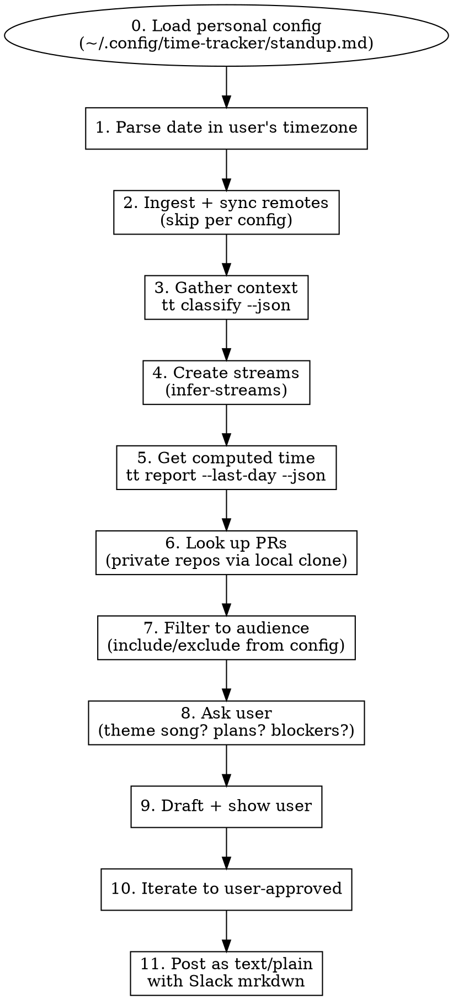

# Daily Standup

Generate and post a daily standup to Slack using time-tracker activity data.

## Phase 0: Load Personal Config

User-specific audience, scope, repos, timezone, and formatting preferences live in a private markdown file (not in this repo). Load it at the start of every run — it's natural language, no parser needed:

```bash
CONFIG=~/.config/time-tracker/standup.md
[ -f "$CONFIG" ] || { echo "Missing $CONFIG — see Setup below"; exit 1; }
cat "$CONFIG"
```

The config covers (in prose):

- **Audience** — channel, channel ID, who reads it, what they care about
- **Scope** — logical projects to include; categories/themes to drop by default
- **Repos** — local clone paths for private repos (since `gh search prs --author=@me` can't see them)
- **Timezone** — day-boundary anchor
- **Remotes** — which machines to sync, which to skip
- **Stream conventions** — commonly reused stream names worth pre-loading
- **Tone/format preferences** — user-specific style notes that apply every day

**If the config is missing**, ask the user to create one before proceeding. See the Setup section at the bottom for a template.

**Everything downstream — audience filtering, tone, PR lookup, sync, dates — derives from this file.** The skill is the workflow; the config makes it yours.

## Audience & Tone (read this first — it controls everything)

**Audience** is described in the "Audience" section of your config. Tone is calibrated to that group.

**Include** only what's in the config's "What the team cares about" section. **Drop everything in the "What the team does NOT care about" section.** If a stream doesn't clearly match an included project, leave it out — the user can ask for it to be added.

**Tone rules (universal):**

- **Team perspective, never individual.** Forbidden phrases: "from my side", "on my end", "from my perspective", "everything works for me". Use "we", "ready for the team", "usable now".
- **No internal jargon without translation.** If a term is project-internal (specific feature codenames, internal bucket labels, internal test naming, etc.), describe what was actually done in plain language.
- **No giant raw URLs.** Always hyperlink with friendly descriptions: `<url|short description of what shipped>`, NOT `<url|#NNNN>` and NEVER bare `https://...`.
- **Brevity wins.** Max ~3 sub-bullets per project. Describe outcomes, not implementation.
- **Don't editorialize what you don't know.** If the user said "might do X", say "may do X" — never upgrade to "planning X" or "committed to X".
- **Don't annotate what you dropped.** Never write "(excluding personal)" or similar. Just don't include it.

## Arguments

- `channel`: Optional. Defaults to the channel specified in your config.
- `date`: Optional. Day to report on (default: yesterday in the timezone from your config). Natural language ok ("yesterday", "Sat May 16", ISO 8601).

## Workflow



## Phase 1: Parse Date (user's timezone)

Use the timezone from your config (Timezone section). Compute the standup day boundary at midnight in that zone.

```bash
# Read the user's local timezone offset from the config (or just check the markdown).
# Yesterday in user's local timezone, converted to UTC:
OFFSET=8  # for Asia/Singapore (UTC+8); read from config
START=$(date -u -d "yesterday 00:00 UTC+$OFFSET" +%Y-%m-%dT%H:%M:%SZ)
END=$(date -u -d "today 00:00 UTC+$OFFSET" +%Y-%m-%dT%H:%M:%SZ)
```

If your zone is UTC+8: yesterday 00:00 local = previous day 16:00 UTC.

## Phase 2: Ingest + Sync Remotes

**CRITICAL: Always run the full pipeline. Partial data = wrong answer.**

```bash
cargo build 2>/dev/null && cargo run -- ingest sessions
```

Sync remotes, skipping any in the config's "Remotes to sync" section's skip list:

```bash
tt machines                   # See what's registered
# Sync every remote NOT in your skip list, e.g.:
tt sync <remote-label>
```

If you parallelize ingest + sync and hit `database is locked`, re-run `tt ingest sessions` once sequentially to finish indexing.

## Phase 3: Gather Context

```bash
tt classify --json --start "$START" --end "$END" > /tmp/classify-yesterday.json
```

Filter to sessions that started or were active in the window:

```bash
# Sessions starting in window
jq -r '[.sessions[] | select(.start_time >= "'"$START"'" and .start_time < "'"$END"'")]
  | sort_by(.start_time) | .[]
  | "\(.session_id)\t\(.project_path)\t\(.duration_minutes // 0)m\tt=\(.tool_call_count)\t\(.stream_id // "-")\t\(.summary // "(none)")"' /tmp/classify-yesterday.json

# Long-running sessions that started earlier but had activity yesterday
jq -r '[.sessions[] | select(
  .end_time != null and .end_time >= "'"$START"'" and .start_time < "'"$START"'"
)] | sort_by(.start_time) | .[]
  | "\(.start_time) → \(.end_time) | \(.project_name) | \(.summary // "(none)")"' /tmp/classify-yesterday.json
```

## Phase 4: Create Streams

**REQUIRED: Invoke the `infer-streams` skill** via the Skill tool (do NOT launch a subagent):

```
Skill("infer-streams")
```

Use the "Streams I recognize across days" section of your config to identify recurring streams without re-naming them. Build the `tt classify --apply` JSON with `assign_by_session` entries for yesterday's sessions, then:

```bash
cargo run -- classify --apply /tmp/standup-assignments.json
```

This persists streams AND runs `tt recompute --force`. On a large DB the recompute may take 2–5 minutes — use a 600s timeout.

Look up existing streams matching your common patterns:

```bash
sqlite3 ~/.local/share/time-tracker/tt.db "SELECT id, name FROM streams ORDER BY name;"
```

## Phase 5: Get Computed Time

**MANDATORY GATE: no time numbers without this step.**

```bash
tt report --last-day --json > /tmp/report-yesterday.json
```

Sources of time data in the JSON (all in milliseconds):

- `totals.time_direct_ms` / `totals.time_delegated_ms` — full-day totals
- `by_tag[]` — direct/delegated per tag. Unique tags (e.g. a per-PR tag) give per-stream split. Multi-stream tags need stream-level slicing.
- For per-stream split when multiple streams share a tag: use the human report `tt report --last-day` (shows stream totals).

**Never** estimate from session metadata (`duration_minutes`, `tool_call_count`) — these ignore attention windows, AFK, parallel sessions and are typically 2x+ wrong.

Convert ms → hours:
```bash
jq '.by_tag[] | {tag, h_direct: (.time_direct_ms / 3600000 * 10 | floor / 10), h_delegated: (.time_delegated_ms / 3600000 * 10 | floor / 10)}' /tmp/report-yesterday.json
```

## Phase 6: Look Up PRs

For private repos listed in the "Repos to look up PRs in" section of your config, use the local clone (since `gh search prs --author=@me` can't see them):

```bash
# Iterate the private clone paths from your config
cd ~/Code/<your-private-repo>
gh pr list --author=@me --state=merged --search "merged:>=$(date -u -d "yesterday" +%Y-%m-%d)" --limit 30 \
  --json url,title,state,updatedAt
gh pr list --author=@me --state=open --limit 30 \
  --json url,title,state,updatedAt
```

For public/global repos, use the broader search:
```bash
gh search prs --author=@me --updated=">=$(date -u -d "yesterday" +%Y-%m-%d)" --json url,title,repository,state
```

**Hyperlink rules.** Every shipped PR in the standup should be linked with a **friendly description**, NOT the PR number. The PR number can appear in parentheses but the link text is the description.

- ✅ `<https://example.com/repo/pull/123|fixes hover state on contact page> (closes 5 open issues)`
- ❌ `[PR #123](https://example.com/repo/pull/123)` — markdown syntax doesn't render in Slack
- ❌ `<https://example.com/repo/pull/123|#123>` — link text is uninformative
- ❌ Bare `https://example.com/repo/pull/123` — giant URL clutter

## Phase 7: Filter to Audience

Use the include/exclude guidance from your config. After classification:

1. Drop any stream that matches an `exclude` entry by name or theme.
2. Keep only streams that map to an `include` entry.
3. Group remaining streams into the include-list buckets (logical projects, not repo names).

If filtering drops significant time (e.g. several hours of excluded work): **do not annotate it**. Show the included projects' direct/delegated times only. Totals are the sum of what you included.

If you're unsure whether a stream belongs: **leave it out**. The user can ask to add it back during iteration.

## Phase 8: Ask the User Three Things

Before drafting, ask:

1. **Theme song?** — If the user often includes a Suno/song link, format as `:musical_note: <song-url|Song Title>` placed right after the date heading. Don't fabricate if not provided.
2. **Today's plans?** — Time-tracker can't see the future. Get plans verbatim. If user says "might do X" or "back-burner Y", reflect THAT EXACT framing — never upgrade "maybe" to "will".
3. **Blockers?** — Default "None" unless user says otherwise. Phrase as a team statement ("None — Y is unblocked for the team"), not personal ("nothing blocking me").

If user gave plans/song in their initial invocation, skip the question.

## Phase 9: Draft

**Template (Slack mrkdwn — `*single asterisk*` for bold, `<url|text>` for links, `•` for bullets):**

```
*Standup - {DayOfWeek} {Date}* :musical_note: <{suno_url}|{Song Title}>

*Yesterday*

• *{Logical Project 1}* — {direct}h direct / {delegated}h delegated
    • {Outcome 1 with hyperlinked PR description}
    • {Outcome 2}

• *{Logical Project 2}* — {direct}h direct / {delegated}h delegated
    • {Outcome with hyperlinked PR}

• *Misc tooling* — ~{direct}m direct / ~{delegated}h delegated
    • {one-line summary of small bits, no sub-bullets}

*Today*

• {Plan item, verbatim from user, with caveats preserved}
• {Plan item}

*Blockers*

• {Blocker or "None"}
```

**Writing rules:**

- Bullets: `•` (Unicode), four spaces indent for sub-bullets.
- Time: copy ms→h from `tt report` exactly. Use 1 decimal (`9h`, `2.5h`, `~30m`).
- Bold uses `*…*` (Slack mrkdwn). `**…**` renders as literal asterisks.
- Skip the song line if user didn't provide one. Don't fabricate.

## Phase 10: Iterate with User

Show the draft and ask for edits. **Expect 1–3 rounds** — common revisions:

- Drop a project they want omitted
- Reword a project name or description
- Fix today's plan phrasing
- Add/swap theme song

Each iteration, re-show the full draft (not a diff). Don't post until user says "post" / "yes" / "send it" / similar explicit go-ahead.

## Phase 11: Post to Slack

**Use `conversations_add_message` with `content_type: "text/plain"`.** Critical: `text/markdown` content type makes the message uneditable in Slack UI. `text/plain` with Slack mrkdwn syntax renders correctly AND stays editable.

```
skill_mcp(mcp_name="slack", tool_name="conversations_add_message",
  arguments='{"channel_id": "<from config>", "content_type": "text/plain", "payload": "<the full Slack mrkdwn message>"}')
```

**Verify after posting:**
- Check the response shows the message timestamp.
- If user says "I can't edit this" → you used the wrong `content_type`. Delete and repost as `text/plain`.

**Delete (only on user request or to retry):**
```bash
secrets SLACK_MCP_XOXP_TOKEN -- sh -c 'curl -s -X POST "https://slack.com/api/chat.delete" \
  -H "Authorization: Bearer $SLACK_MCP_XOXP_TOKEN" \
  -H "Content-Type: application/json" \
  -d "{\"channel\": \"<channel_id>\", \"ts\": \"<message_ts>\"}"'
```

## Common Mistakes (DO NOT REPEAT)

| Mistake | Fix |
|---------|-----|
| Mentioning anything in the config's exclude list | **Drop it.** Audience doesn't care. If unsure, leave out. |
| "from my side" / "on my end" / first-person framing | Use team language: "we", "ready for the team", "X is usable now" |
| Internal jargon (project-internal codenames, bucket labels, etc.) | Translate to plain description of what was actually done |
| Giant raw URLs in post | Hyperlink friendly description: `<url|short outcome>` |
| `[PR #N](url)` markdown syntax | Use Slack mrkdwn `<url|description>`. Markdown links DON'T render. |
| `content_type: "text/markdown"` | Use `"text/plain"` — markdown content type breaks editability |
| `**bold**` (double asterisk) | Use `*bold*` (single asterisk) — Slack mrkdwn |
| `## headers` | Slack mrkdwn has no headers. Use bold lines. |
| `gh search prs --author=@me` for private repos | Use local clones from your config |
| Hyperlinking `#NNNN` instead of description | Hyperlink the **outcome description**, not the number |
| Inferring/upgrading today's plans | Copy user's framing verbatim. "might do" stays "may do". |
| Skipping ingestion or remote sync | Run full pipeline every time. Partial = wrong. |
| Estimating time from session metadata | Always use `tt report` ms values. Estimates are 2x+ wrong. |
| Syncing machines in the config's skip list | Skip them by default — only sync if user explicitly asks |
| Reporting by repo (`dotfiles`, `home`) | Group by logical project per the config's include list |
| Wrong day boundary | Use the timezone from your config, not UTC or Pacific by default |
| Posting without confirming | Always show draft → wait for explicit go-ahead |
| Annotating "(excluding personal)" | Don't draw attention to what was dropped. Just omit. |

## Example Output (Slack mrkdwn, generic shape)

```
*Standup - Wed Mar 12* :musical_note: <https://example.com/song|Theme Song>

*Yesterday*

• *Project A — milestone work* — 6h direct / 12h delegated
    • Shipped <https://example.com/repo/pull/123|customer-facing fix for hover bug> (closes 3 reported issues)
    • Landed supporting changes: <https://example.com/repo/pull/124|docs into agents/skills>, <https://example.com/repo/pull/125|error surfacing on infra failures>
    • One cleanup ahead: noticed tests are taking the easy path; going to tighten the test-writing skill so agents stop doing that. *Not a blocker — Project A is usable for the next phase now.*

• *Project B — consolidation* — 2h direct / 4h delegated
    • Landed <https://example.com/repo/pull/130|combined three follow-up fixes into one PR>
    • Plus <https://example.com/repo/pull/131|restore safety check> and <https://example.com/repo/pull/132|filter env contexts>

• *Misc tooling* — ~30m direct / ~3h delegated
    • CI workflow inputs, devbox connectivity recovery, standup pipeline sync improvements

*Today*

• Weekly review
• May land the long-running refactor PR (might deploy to a test repo first as a precaution before submission)

*Blockers*

• None
```

## Setup (first run)

If `~/.config/time-tracker/standup.md` doesn't exist, create one as natural-language guidance for the agent. Suggested structure (adapt freely — no parser, just prose):

```markdown
# Daily Standup — Personal Config

## Audience

Which Slack channel and channel ID; who reads it (names, roles); what they care about; what tone fits.

## What the team cares about

Logical projects to include. Describe each in plain language with examples of what kinds of work fall under it. Add subgrouping cues (e.g., "anything in `/path/x/` belongs to project Y").

## What the team does NOT care about (default-drop)

Categories/themes to omit unless explicitly requested. Be specific: name personal projects, tooling rabbit-holes, internal-only work, etc.

## Repos to look up PRs in

Local clone paths for private repos (so `gh pr list` works). Note which repos are personal vs work — personal repo PRs should not surface in the standup.

## Timezone

Local timezone for day boundaries (e.g., "Asia/Singapore (UTC+8)").

## Remotes to sync

Which `tt sync <label>` machines to pull from; which to skip by default.

## Streams I recognize across days

Stream names you commonly reuse — the agent should match these before creating new ones.

## Format / tone preferences

Theme song handling, tone rules (e.g., team perspective), formatting preferences, anything else style-related.

## Examples of past blockers worth surfacing

Optional. The kinds of things you'll actually call out as a blocker.
```

Save it, then re-run the skill.
